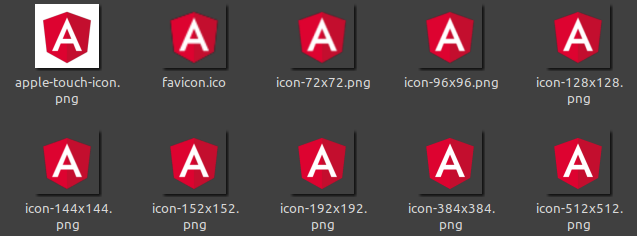

# pwa-icons



Generate default @angular/pwa icon set for angular projects using a custom .png icon.

**Inspired By:** [ngx-pwa-icons](https://github.com/pverhaert/ngx-pwa-icons)

**Supports:** version 6+ | **Last Tested:** version 10.   

### Usage

1. Add PWA capabilities to your existing Angular app.

```bash
$ ng add @angular/pwa --project=project-name
```  

2. Create a .png icon in the root folder of your Angular project.

```
project-name 
└───src   
└───icon.png ✓
```

3. Install pwa-icons to your angular app.

```bash
$ npm install @wam/pwa-icons
```  

4. You can also generate pwa-icons for your angular app.

```bash
$ ng run @wam/pwa-icons --project=project-name
```  

For good results, your `icon.png` file should be:

- square
- transparant background
- at least 512*512px

### Available Options:

`-h` or `--help` Show help   
`-v` or `--version` Show package version number   
`-d` or `--dry-run` Run through without making any changes  
`-i` or `--icon` Original icon to convert (defaults to **"./icon.png"**)   
`-o` or `--output` Output folder  (defaults to **"./src/assets/icons"**)   
`-fo` or `--faviconOutput` Output folder for favicon.ico  (defaults to **"./src"**) 
`-n` or `--name` Icon name.   
